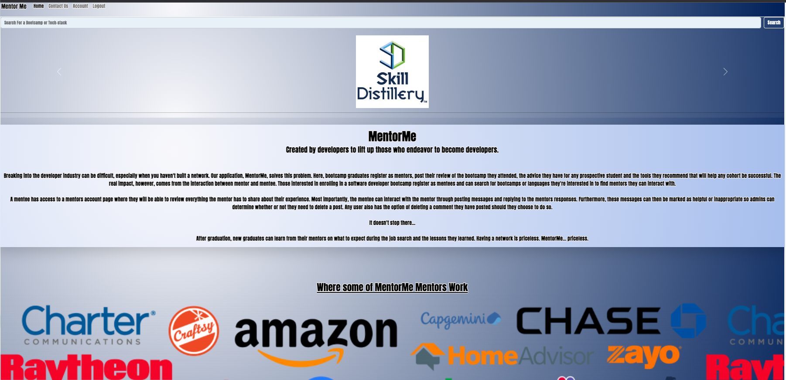
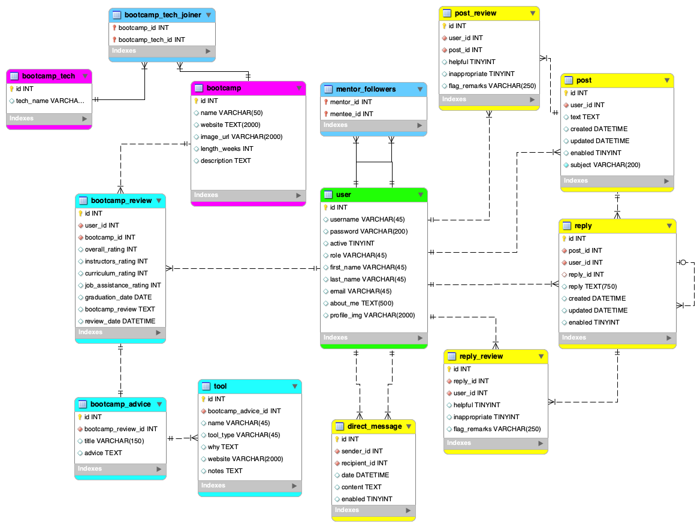
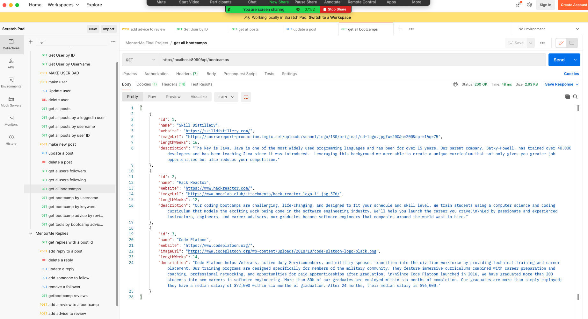
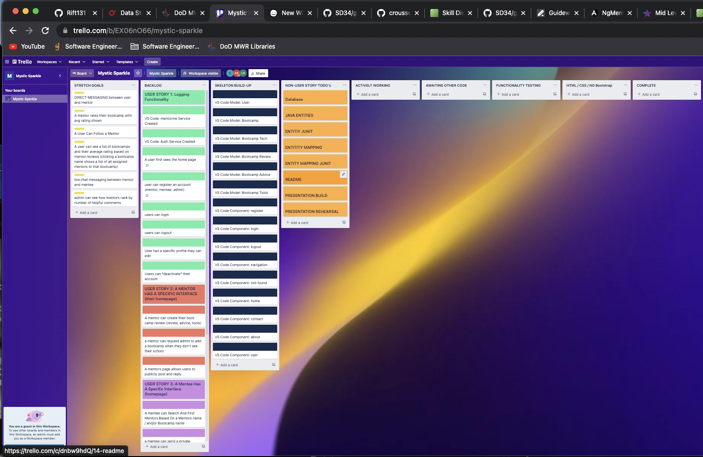
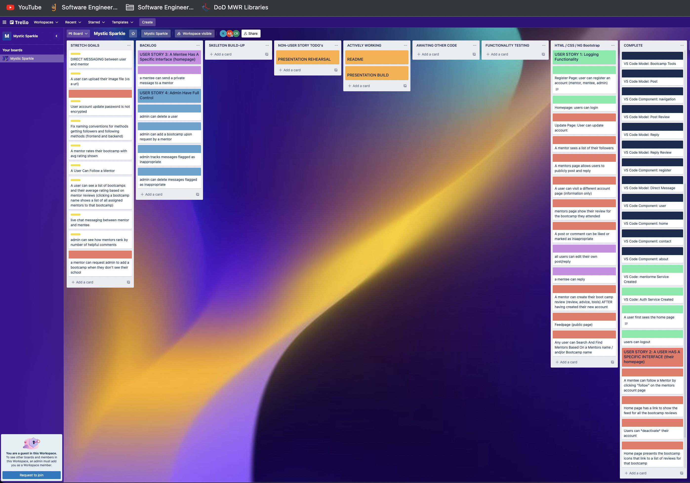
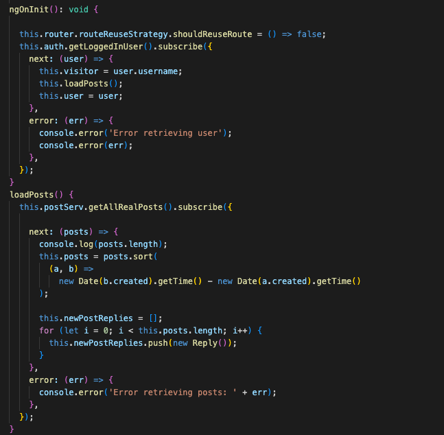
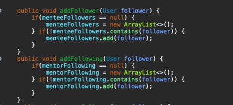
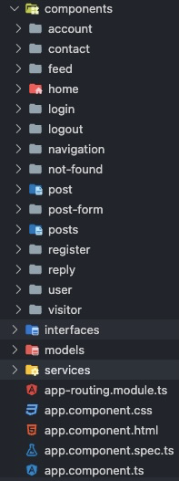

# MentorMe

## Authors

 Austin Borck (Scrum Master, Developer) 

 Chad Rousseau (Repo Owner, Developer) 

 Ken Pederson (Database Administrator, Developer) 

 
 

## Overview

<strong>
Created by developers to lift up those who endeavor to become developers.
</strong>

Breaking into the developer industry can be difficult, especially when you haven't built a network. Our application, MentorMe, solves this problem. Here, bootcamp graduates register as mentors, post their review of the bootcamp they attended, the advice they have for any prospective student and the tools they recommend that will help any cohort be successful. The real impact, however, comes from the interaction between mentor and mentee. Those interested in enrolling in a software developer bootcamp register as mentees and can search for bootcamps or languages they're interested in to find mentors they can interact with. 

<strong>
It doesn't stop there...
</strong>

After graduation, new graduates can learn from their mentors on what to expect during the job search and the lessons they learned. Having a network is priceless. MentorMe... priceless. 

## Visit MentorMe!

If you would like to visit our site and take it for a test drive, see the link below. Any visitor can register a new account or utilize one of two accounts pre-built in the database...

* Mentee username: lightning, password: guest5
* Mentor username: splinter, password: mentor4  

<a href="http://184.169.170.189:8080/MentorMe/#/home">MentorMe</a></>

If you would like to test the backend of the application, reference the table within the "Testing With Postman" section below for example URI's you can use to interact with the applications functionality.

## Description

When a user visits our site, there are 4 possible paths...

1. A visitor who has access to view bootcamps and their associated reviews and discussions. Furthermore, the user can perform a search from the home page for a specific bootcamp, different languages or tech they're interested in such as "Java" or "Angular". With this general access, the intent is to prove to the visitor that they will highly benefit from creating a personal account and thereby being able to ask their personal questions to mentor that helps them shape their approach to being successful in their future bootcamp environment. If the visitor is a prior bootcamp graduate, the site is designed to inspire them to register an account and become an additional mentor and add a new bootcamp to the pool. 

2. In addition to the access granted to a visitor, a mentee, once logged in, can actively engage with the MentorMe community via the post/reply system. Furthermore, they can choose to "follow" a mentor to add a convenient link to their account page for instant access back to the mentors account page. Additionally, a mentee can flag messages as being either helpful or inappropriate. Finally, the relationship between mentee and mentor culminates in the mentee reaching out to the mentor for job-search advice and networking.

3. A mentor posts their review, advice and tools for mentees to view and create a starting point to initiate a "mentoring" conversation with them. 

4. An administrator can ensure inappropriate activities are policed as well as add additional bootcamps as mentors register who have graduated from bootcamps not yet in the collection of bootcamps in the database. 

## Methodology

Teamwork. Full stop. 

As a team of veterans, we each understood the division and sharing of responsibilities. Our 1-week sprint to achieve an MVP fully depended on this foundation and the reliance on the tools common among professional developers, specifically Agile methodologies...

Planning

* Each day began with Austin leading a scrum meeting. After referencing our Trello board and wiring diagram as needed, tasks were laid out and any blockers were made known. 

Executing

* Each team member worked in Zoom to maintain constant communication when development required a swarm technique to push past a blocker. Any work performed during off hours was pre-coordinated and communicated via the teams Slack channel to ensure merge conflicts were avoided. Additionally, each member of the team kept their respective work on their own branch before commiting changes to the main branch. All merges with main were pre coordinated as well to ensure pulls were performed and no ones branch was left behind. As a result, only a single merge conflict occurred during the entire sprint (a minor spacing difference). 

Evaluating

* In conjunction with the Trello board, timeboxing proved vital to make the timely transition from building functionality to focusing on the styling of the site and preparation for our presentation. As a result, the transitioning from the different focuses were smooth and alleviated the majority of the stress that would occur with falling behind. A side benefit that cannot be understated is the team stayed healthy because of communication and planning. 

## Lessons Learned

Austin Borck

* The biggest lesson I learned is how to properly plan and design an application, what classes/components should do what and to think in English before thinking in code. Jumping directly into the coding without a detailed plan is the best way to get confused, frustrated and produce poorly written code. A small issue I would change in the future is management of components and services since it felt like we had a couple things doing the same job. I learned being more defined on simple things such as naming a boolean to toggle information on a page, and field names in the backend to match the front end on the first try.

Chad Rousseau

* Teamwork is essential to success. Everyone on the team put their minds together to overcome issues and solve problems. Constant communication has helped us succeed as a team and stay on top of any issues that we had or could have had. We have maintained comms throughout changes in code in order to avoid merge conflicts that take valuable time away from building the app.

Ken Pederson

* This project expanded our use of Angular beyond anything we had ever done before. Learning how to work with multiple Components and Services and how they "talk" to the backed was probably my favorite "light bulb" moment of the project. I look forward to going back to earlier projects and implementing more components and services. 
Communication is always something I aim to improve at. Working a project remotely presents unique challenge of only one person being able to talk at a time. I feel I was able to gain a better sense of when to speak up so that I wouldn't "step on" someone else talking.  

## Unimplemented Features

As discussed earlier, timeboxing was critical to our success. Given that our sprint lasted only a week, the team established a timehack two and a half days before presentation for ceasing functionality creation. Once we were outside of that timebox, we transitioned to the Bootstrap and CSS aspects of the application. Because of this, some functionality remains to be implemented. The following remain to be implemented at a later date (not an exhaustive list)...

1. Instant messaging between users (the yellow table at the six o'clock position of the database schema above)
2. The ability for a new mentor to fully register the bootcamp they attended. At this stage, only the review itself and not the advice or tools portion, can be created.
3. The ability for a new mentor to send a request to admin to create a bootcamp that isn't included yet in the drop-down selection menu.

## Testing the Backend With Postman

To test the backend of the application, a user may visit the <a href="https://www.postman.com/">Postman</a> site. Once set up, reference the table below for URI's testing the validity of the code once you've started up the program in the SpringToolSuite4 Boot Dashboard. For the URI's below to function, ensure the authorization type is set to basic. Set the username to "sage" and the password to "mentor". 

> For testing a non-deployed, local version of the application, each URI is preceded with "http://localhost:8090/api/"

| HTTP Verb | URI                        | Request Body | Response Body        | Functionality                                                              |
|:---------:|:---------------------------|:------------:|:---------------------|:---------------------------------------------------------------------------|
| GET       | 'account/grasshopper'      |              | Single user          | Return a user by their id                                                  |
| GET       | 'bootcamps'                |              | List of bootcamps    | Return a list of all bootcamps                                             |
| GET       | 'bootcamps/search/KEYWORD' |              | List of bootcamps    | Return a list of boot camps by searching their name or tech                |
| POST      | 'posts'                    |     JSON     | Created post message | Create a new message posting                                               |
| POST      | 'replies/1'                |     JSON     | Created Post reply   | Create a reply to a posted message                                         |
| PUT       | 'account'                  |     JSON     | Updated user account | Update a users account information                                         |
| DELETE    | 'posts/3'                  |              |                      | Delete a post belonging to the logged in user                              |

* Example code to use for POST routes below. Note that the date and subject may be omitted due to default values being set in the service file.

> {
        "text": "New Post text",
        "subject": "New Post Subject"
   }
   
* Example code to post a reply to a posted comment

> {   "text": "NEW REPLY TO THIS POST" }

* Example code to update a users account information

> {
    “username”: “New username”,
    “password”: “New password”,
    “firstName”: “New first name”,
    “lastName”: “New last name”,
    “email”: “New email”,
    “aboutMe”: “New aboout me”
}

## Technologies 

* Angular
* AWS- EC2
* Bootstrap
* Git
* GitHub
* Gradle
* Java 
* MySQL Workbench
* Postman
* RESTful Services
* SpringToolSuite4
* Spring Data JPA
* Spring Boot
* Spring MVC
* Terminal -zsh
* TypeScript

## A Few Screen Shots Of Code Taken During The Development Journey

* These two images compare and contrast where the team started to being nearly ready for presentation. A ton of moving pieces simplified through Agile teamwork and solid communication!

 

 

 
* Code excerpt of how a post is loaded. This was probably one of the most challenging aspects of the code to make functional.

 

 
* Code excerpt of creating interactivity in messages to enable admins to police the site, track the most effective contributors and give a greater sense of community.

 

 
* A portion of the Angular files created to make MentorMe a reality. 

 

 